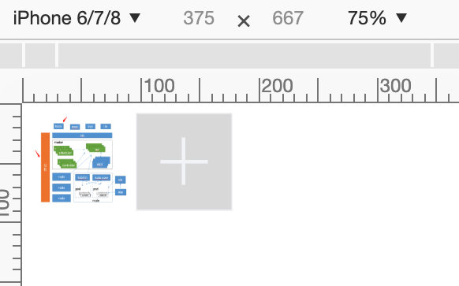

![Built With Stencil](https://img.shields.io/badge/-Built%20With%20Stencil-16161d.svg?logo=data%3Aimage%2Fsvg%2Bxml%3Bbase64%2CPD94bWwgdmVyc2lvbj0iMS4wIiBlbmNvZGluZz0idXRmLTgiPz4KPCEtLSBHZW5lcmF0b3I6IEFkb2JlIElsbHVzdHJhdG9yIDE5LjIuMSwgU1ZHIEV4cG9ydCBQbHVnLUluIC4gU1ZHIFZlcnNpb246IDYuMDAgQnVpbGQgMCkgIC0tPgo8c3ZnIHZlcnNpb249IjEuMSIgaWQ9IkxheWVyXzEiIHhtbG5zPSJodHRwOi8vd3d3LnczLm9yZy8yMDAwL3N2ZyIgeG1sbnM6eGxpbms9Imh0dHA6Ly93d3cudzMub3JnLzE5OTkveGxpbmsiIHg9IjBweCIgeT0iMHB4IgoJIHZpZXdCb3g9IjAgMCA1MTIgNTEyIiBzdHlsZT0iZW5hYmxlLWJhY2tncm91bmQ6bmV3IDAgMCA1MTIgNTEyOyIgeG1sOnNwYWNlPSJwcmVzZXJ2ZSI%2BCjxzdHlsZSB0eXBlPSJ0ZXh0L2NzcyI%2BCgkuc3Qwe2ZpbGw6I0ZGRkZGRjt9Cjwvc3R5bGU%2BCjxwYXRoIGNsYXNzPSJzdDAiIGQ9Ik00MjQuNywzNzMuOWMwLDM3LjYtNTUuMSw2OC42LTkyLjcsNjguNkgxODAuNGMtMzcuOSwwLTkyLjctMzAuNy05Mi43LTY4LjZ2LTMuNmgzMzYuOVYzNzMuOXoiLz4KPHBhdGggY2xhc3M9InN0MCIgZD0iTTQyNC43LDI5Mi4xSDE4MC40Yy0zNy42LDAtOTIuNy0zMS05Mi43LTY4LjZ2LTMuNkgzMzJjMzcuNiwwLDkyLjcsMzEsOTIuNyw2OC42VjI5Mi4xeiIvPgo8cGF0aCBjbGFzcz0ic3QwIiBkPSJNNDI0LjcsMTQxLjdIODcuN3YtMy42YzAtMzcuNiw1NC44LTY4LjYsOTIuNy02OC42SDMzMmMzNy45LDAsOTIuNywzMC43LDkyLjcsNjguNlYxNDEuN3oiLz4KPC9zdmc%2BCg%3D%3D&colorA=16161d&style=flat-square)

一个WEB组件，用来在移动端选择图片。效果如下：



安装、使用方式， 以ionic&angluar为为例。其它框架暂时没有测试过。

## 安装

首先，先执行这里写的步骤：https://stenciljs.com/docs/angular/

然后...
```
npm install https://github.com/liuhengloveyou/ion-image-picker --save
```
或者像这样：
```
npm install ../ion-image-picker/ --save
```

## 使用

像其它任何组件一样：

```html
<ion-item>
  <ion-image-picker></ion-image-picker>
</ion-item>
```


## 数据绑定

比较尴尬。还没学会怎么用angular在web组件上做双向数据绑定，stenciljs官方帮助文档里也没找到方法。所以我们先用事件方式做数据通信。如下：

```html
<ion-item>
  <ion-image-picker [value]="images" (ionChange)="imageChanged($event)"></ion-image-picker>
</ion-item>
```

js:

```js
imageChanged(event: CustomEvent) {
  console.log(event.detail);
  this.images = event.detail;
}
```


## 参数

- max:	最多能选择、显示多少张图片。